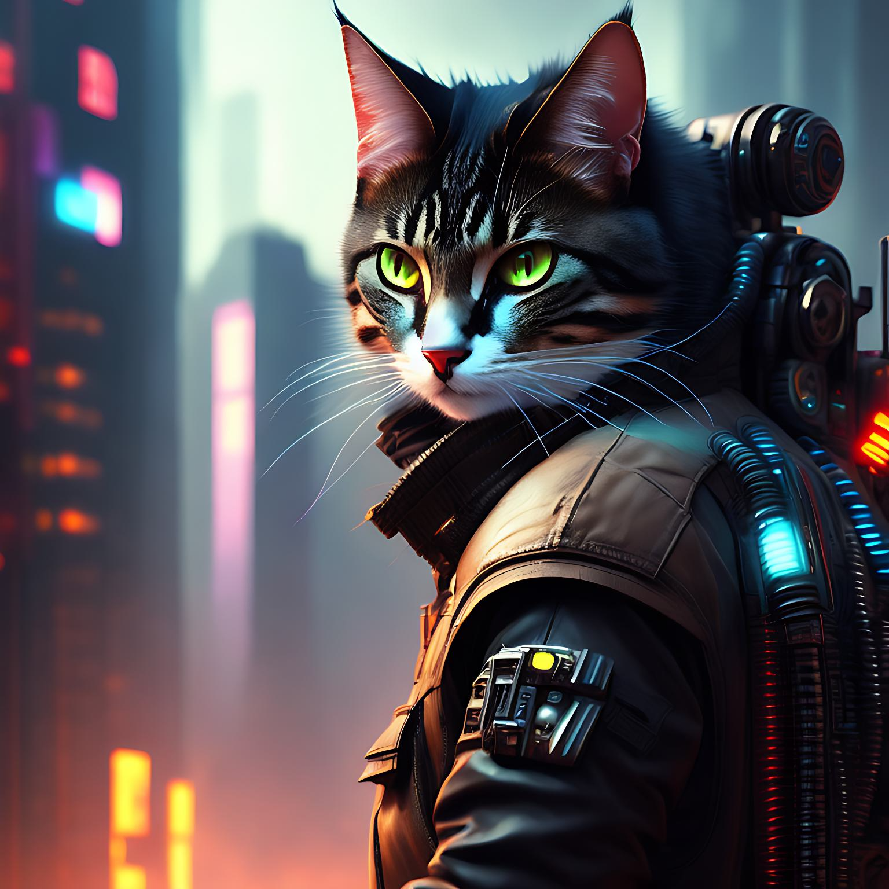

# 
AICAT - A top-level Web3 virtual pet project created to bring the next 1 billion people into the blockchain

## Background

Since the birth of Bitcoin, blockchain technology has gradually become a hot topic worldwide, and has also received widespread attention and application from various industries. The emergence of blockchain technology has broken the limitations of traditional finance and asset trading, making digital assets and virtual economies possible. The rise of virtual pets is a very popular category in the digital asset market, and it has become a major highlight in the digital asset market.

In urban life, people's spiritual needs are increasingly valued, so virtual pets as a way of spiritual comfort have gradually become popular. Different from traditional pets, virtual pets can accompany people in the digital world, bring them joy and companionship, and also have scarcity and collection value.

In this context, the birth of the AICAT project aims to bring more fresh and unique elements to the digital asset market, providing users with a brand new and interesting digital asset experience through virtual cat farming. At the same time, the AICAT project will be based on blockchain technology to achieve decentralization and value assurance of digital assets, providing users with a safer and more reliable digital asset trading environment.

## Introduction

AICAT is a virtual pet farming project based on blockchain technology. Users can purchase AICAT's NFTs on the Web3 platform and raise, cultivate, and collect unique virtual cats in the digital world.

AICAT's virtual cats have unique appearance and personality, and have scarcity. Each virtual cat is unique. Users can interact, breed, and cultivate virtual cats to win in-game rewards and rare items, and gain higher profits through the growth and evolution of virtual cats.

AICAT's NFTs will be pre-sale on the Opensea platform, allowing users to acquire ownership of virtual cats and enjoy subsequent profits and benefits by purchasing NFTs. At the same time, the AICAT team will conduct an air drop of AICAT tokens based on the number of NFTs held by users, in order to feedback users' support and participation in the project.

## Airdrop and reward program

The AICAT project will conduct an airdrop of AICAT tokens based on the number of NFTs held by users, in order to reward their support and participation in the project. Specifically, the AICAT team will allocate 70% of the total amount of AICAT tokens to NFT holding users and community building during airdrop activities. 30% airdrop to users who have received ARB airdrop.

The AICAT tokens will be issued based on the ARB (Arbitrum) blockchain and comply with the ERC-20 standard. The total issuance of AICAT tokens is 150 billion. The more AICAT NFT users hold, the more AICAT token airdrop rewards they will get. Users can also get more AICAT token rewards by participating in AICAT ecological construction and Community Governance.

## Ecological construction and Community Governance

AICAT project is committed to building a complete digital asset ecosystem. Through an open, fair and transparent Community Governance mechanism, community users can participate in project decision-making and management, and promote the sustainable development of the ecosystem.

### Community Governance

AICAT will adopt a decentralized Community Governance model, establish a DAO (decentralized autonomous organization) mechanism based on smart contracts, and let community users participate in project decision-making and management. Community users can participate in project decision-making and operation through voting, proposals, and other means, jointly promoting the development of AICAT projects. The AICAT team will be committed to maintaining close interaction with community users, listening to user feedback and suggestions, and continuously improving and optimizing projects based on user feedback and suggestions.

### Ecological Construction

AICAT will collaborate with other digital asset projects and blockchain ecosystems to promote the development and growth of the ecosystem. The AICAT team will develop ecological applications, establish community partnerships, expand the digital asset ecosystem, and bring more digital asset experiences and value to users.

AICAT will develop a variety of ecological applications, including virtual pet games, digital art trading platforms, social platforms, etc. These applications will be combined with the AI-CAT virtual pet farming project to provide users with a more diverse digital asset experience. At the same time, AICAT will actively engage in community cooperation, establish partnerships with other digital asset projects and blockchain ecosystems, and jointly promote the development and growth of the digital asset ecosystem.

AICAT will actively participate in community construction and provide better services and support to community users. AICAT will establish a Community Governance committee elected by community users to supervise the development and operation of the project and protect the interests and rights of community users. The AICAT team will also establish a user support and complaint mechanism, promptly handle user feedback and complaints, and improve user satisfaction and trust.

AICAT will be committed to building a secure and reliable digital asset ecosystem, bringing users more digital asset experiences and value. The AICAT team will work with community users to promote the development and growth of the ecosystem, making AICAT a leader in the field of digital assets.

## Summary

The AICAT project is a passionate and creative digital asset ecosystem. It is not only a virtual pet breeding project, but also an artwork created by like-minded digital asset enthusiasts. Our team members are selflessly contributing to this project, committed to making AICAT a leader in the field of digital assets.

We believe that the value of digital assets lies not only in their own characteristics and attributes, but also in the creativity and imagination of the people who created them. The vision of the AICAT project is to create a diverse, open, just, and transparent digital asset ecosystem, allowing digital asset enthusiasts to unleash their creativity, jointly create more digital asset artworks and experiences, and promote the development and growth of the digital asset ecosystem.

The AICAT team will continuously improve and optimize the project, listen to the opinions and suggestions of community users, and strive to provide users with a better digital asset experience and services. We believe that AICAT will become a shining pearl in the digital asset ecosystem, allowing digital asset enthusiasts to experience more creativity and value.
